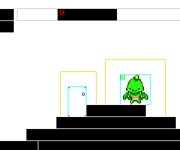

<p align="center">
  
</p>

<h1 align="center">HoneyComb</h1>

<p align="center">
  A 2D platform-genre physics simulator built from scratch in Java.
</p>

<p align="center">
  
</p>

## Overview

HoneyComb is a self-contained 2D platformer engine written entirely in Java with **no external dependencies or libraries**. Every system — rendering, physics, collision, AI, and animation — is implemented from the ground up on top of Java's standard library (AWT/Swing).

## Demo

Video Demonstration: https://www.youtube.com/watch?v=DzfVCyHGR-8

## Key Technologies

- **Java** — 100% pure Java, no third-party libraries or frameworks
- **Custom Physics Simulator** — hand-rolled 2D platformer physics (movement, gravity, collision, tangible/partially-tangible borders)
- **A.I.** — customizable state-machine driven AI (e.g. Wander/Chase) with artificial "senses" powered by nested focus/detection zones for advanced target awareness
- **Modular Design** — generic, extensible entity hierarchy (`Actor` → `Movable`/`Neeple` → `Character` → `Human`/`Robot`) that cleanly separates game logic, windowing, and rendering
- **Animations** — sprite-based animation system for characters and effects
- **Swing/AWT** — used for windowing, rendering, and input handling

## Project Structure

```
src/com/mandarin/
├── Main.java              # Entry point
├── logic/                 # Core game logic
│   ├── Game.java          # Game loop, camera focus, and interaction checks
│   ├── Level.java         # Level state and bounds
│   ├── Animation.java     # Sprite animation system
│   └── entity/            # Entity hierarchy
│       ├── Actor.java / Movable.java
│       ├── border/        # Borders and collision (Border, MovableBorder)
│       └── neeple/        # Characters
│           ├── Character.java / MCharacter.java
│           └── character/
│               ├── Player.java
│               ├── human/Human.java
│               └── robot/Robot.java   # State-machine AI (Wander/Chase)
└── window/                # Windowing and GUI
    ├── FrameManager.java
    └── gui/                # Menu, game, and level editor frames/panels
```

Levels and assets live under `resources/` (`levels/` for maps, `media/images/` for sprites).

## Author

Developed by [Nykolas Farhangi](https://github.com/crudemandarin).
